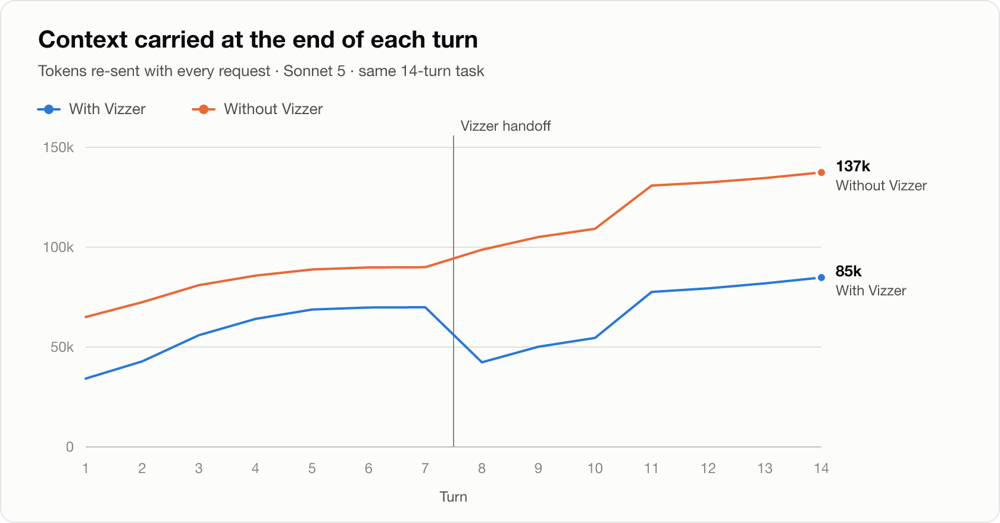
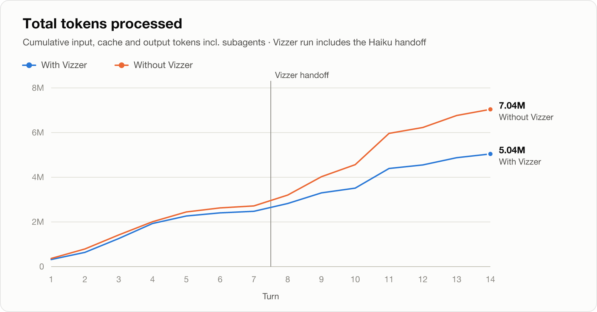
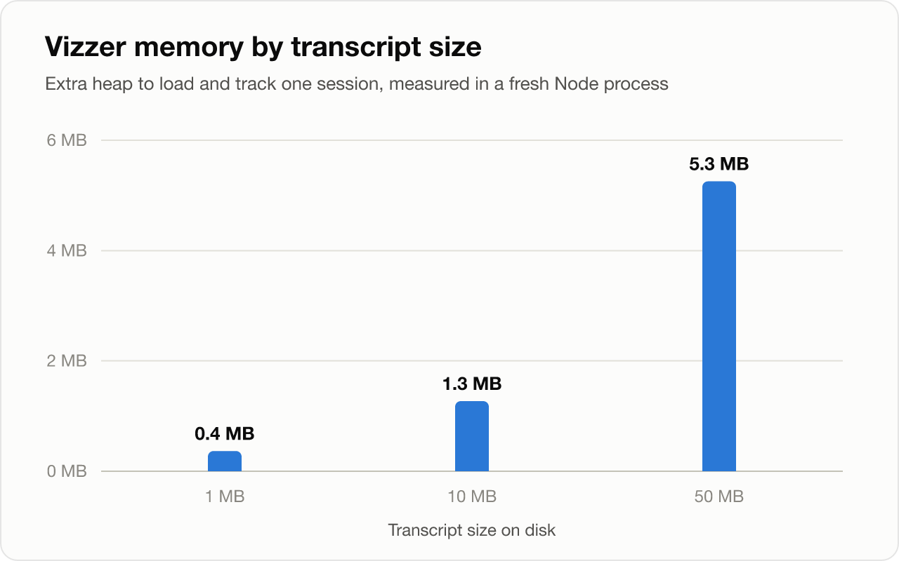

# Vizzer — Claude Code token visualizer

Vizzer shows, live, how many tokens each **Claude Code session** in your workspace is carrying, which model it runs on, and when the context has grown large enough that you'd be better off in a fresh session. When that point comes, one click has **Haiku** write a handoff document, and Vizzer opens a new Claude Code session that continues from it.

Account-level meters tell you how much of your plan you've used. Vizzer shows the per-session number behind that: every message in a session re-sends the whole context, so a 400k-token session costs about 400k input tokens per turn, cached or not.

## Features

- **Status bar meter**: `Opus 5 · 182k/1M · 18%` for the session you're working in. It turns yellow or red as the session crosses your thresholds. Hover for a token breakdown (fresh input, cache write, cache read, output) for the last request and the whole session.
- **Sidebar panel**: a card for the focused session with a context gauge, a per-response context chart (compactions marked), token totals, and subagent usage. Below it is a list of every recent session in the workspace. Click one to pin it.
- **Handoff advice**: Vizzer warns once when a live session re-sends more than a set number of tokens per message (default 150k, critical at 300k) or fills a set share of its window (60% / 80%), whichever comes first. Warnings can be snoozed or muted per session.
- **One-click handoff**:
  1. Vizzer condenses the transcript locally (the goal, recent activity, files edited, the latest todo list) to fit Haiku's window.
  2. It runs `claude -p --model haiku` with your existing Claude Code login. No API key is needed, and no extra session is recorded.
  3. It saves the document to `.vizzer/handoffs/<date>-<title>.md` and opens it for you to review.
  4. It opens a new Claude Code tab with a prompt pre-filled to continue from the handoff. You press Enter.

## Benchmark

<!-- benchmark:start -->
Measured 2026-09-11 with Claude Code 2.1.123 on macOS (Darwin 24.6.0 arm64). Both runs used Sonnet 5 to perform the same 14-turn coding task ([bench/tasks.ts](bench/tasks.ts)) on separate copies of this repository: one kept a single session, the other used Vizzer's handoff (written by Haiku) after turn 7 and continued in a fresh session.

**The handoff cut the context from 70k to 28k tokens (−60%). After it (turns 8–14), the Vizzer run processed 1.75M fewer tokens (−41%) and cost $0.39 less (−21%) than the single long session.**

Turns 1–7 ran under identical conditions in both runs and still differed by −9% in tokens processed. That is ordinary run-to-run variation, so the after-handoff rows are the fairer comparison.





| Metric | Without Vizzer | With Vizzer | Change |
| --- | ---: | ---: | ---: |
| Peak context | 137k | 85k | −38% |
| Avg. context per request, turns 8–14 | 116k | 58k | −50% |
| Context at the last turn | 137k | 85k | −38% |
| Tokens processed, turns 1–7 (before handoff) | 2.72M | 2.48M | −9% |
| Tokens processed, turns 8–14¹ | 4.32M | 2.57M | −41% |
| Tokens processed, whole task¹ | 7.04M | 5.04M | −28% |
| Estimated cost, turns 8–14² | $1.82 | $1.43 | −21% |
| Estimated cost, whole task² | $3.15 | $2.69 | −15% |
| Model time | 8.5 min | 10.6 min | +25% |
| API requests | 74 | 87 | +18% |
| Auto-compactions | 0 | 0 | |
| Tests at the end | ✅ 115 passed (115) | ✅ 110 passed (110) | |
| Typecheck at the end | ✅ passed | ✅ passed | |
| Final-summary recall³ | 10/10 | 6/10 | |

**Not mentioned in the final summary** (the code itself is covered by the test and typecheck rows): With Vizzer (handoff after turn 7): `firstActivity`, `durationMs`, `format.ts`, `sessionAccumulator.ts`.

**Handoff:** Vizzer condensed the 70k-token session into a 9,312-character digest; Haiku turned it into a 4,818-character handoff file in 36 s (6.9k tokens, $0.02).

<details>
<summary>Per-turn data</summary>

| Turn | Context without | Context with | Tokens without | Tokens with |
| ---: | ---: | ---: | ---: | ---: |
| 1 | 65k | 34k | 364k | 317k |
| 2 | 73k | 43k | 426k | 321k |
| 3 | 81k | 56k | 629k | 620k |
| 4 | 86k | 64k | 590k | 672k |
| 5 | 89k | 69k | 439k | 337k |
| 6 | 90k | 70k | 179k | 139k |
| 7 | 90k | 70k | 91k | 71k |
| 8 | 99k | 42k | 484k | 341k |
| 9 | 105k | 50k | 822k | 476k |
| 10 | 109k | 55k | 540k | 214k |
| 11 | 131k | 78k | 1.4M | 879k |
| 12 | 132k | 79k | 264k | 158k |
| 13 | 135k | 82k | 536k | 323k |
| 14 | 137k | 85k | 275k | 170k |

</details>

### Vizzer’s own overhead

Without Vizzer nothing extra runs. With it, the extension tails transcripts incrementally; this is what it costs, measured on synthetic transcripts in a fresh Node process (`npm run bench:overhead`). Heap is what Vizzer keeps while tracking a session. RSS growth is mostly the transient buffer from reading the whole file at start-up, which the process doesn’t hand back to the OS right away.



| Transcript | Initial load | CPU | Heap | RSS | Idle rescan | Update latency (median / p95) |
| ---: | ---: | ---: | ---: | ---: | ---: | ---: |
| 1 MB | 6 ms | 8 ms | 0.4 MB | 7.4 MB | 0.2 ms | 134 / 136 ms |
| 10 MB | 21 ms | 33 ms | 1.3 MB | 44.5 MB | 0.3 ms | 135 / 136 ms |
| 50 MB | 86 ms | 123 ms | 5.3 MB | 188.3 MB | 0.4 ms | 137 / 138 ms |

¹ Input + cache write + cache read + output tokens, subagents included; the Vizzer column includes the handoff call.  
² Claude Code’s client-side estimate at API list prices. Subscription plans meter usage differently.  
³ How many of 10 identifiers created during the task (e.g. `formatDuration`, `cacheHitRate`) the final turn’s summary mentions.

One run per arm, so expect some variation between runs; turns 1–7 were also run independently in each arm. Reproduce with `npm run bench:run` (uses your Claude plan), `npm run bench:overhead`, then `npm run bench:report`. Raw data: [bench/results/](bench/results/).
<!-- benchmark:end -->

## Requirements

- VS Code 1.90+ or a VS Code-based editor (Cursor, Windsurf, …).
- Claude Code: the VS Code extension for the new-session tab, and the `claude` CLI on your machine for writing handoffs ([setup](https://code.claude.com/docs/en/setup)). If VS Code can't find the CLI, set `vizzer.claudePath`.

## How it works

Claude Code stores each session as an append-only JSONL transcript under `~/.claude/projects/<encoded-project-path>/<session-id>.jsonl` (or under `CLAUDE_CONFIG_DIR`). Each assistant entry records the model and the API's token usage. Vizzer:

- finds the transcript folders for your workspace folders, including sessions started in subfolders;
- tails them incrementally (only new bytes are read) using `fs.watch`, with polling as a fallback;
- counts each API message once, even though Claude Code writes one entry per streamed content block;
- takes the current context size as `input + cache_creation + cache_read` of the latest main-conversation request, the same formula Claude Code's own status line uses. Subagent traffic is counted separately because it doesn't occupy your session's context.

Vizzer only **reads** `~/.claude`. It never writes there. Nothing leaves your machine except the handoff request, which goes through your own `claude` CLI.

### Context window size

Transcripts don't record the window size. Vizzer infers it from the model (Haiku 4.5: 200k; Sonnet 5, Fable, Opus 4.7+: 1M) and switches to 1M once a session has gone past 200k. If your plan runs Opus with a 200k window, set `vizzer.contextWindowOverride` to `200000`. The absolute token thresholds still protect you either way.

## Settings

| Setting | Default | Description |
| --- | --- | --- |
| `vizzer.thresholds.warnTokens` | `150000` | Warn at this many context tokens re-sent per message. |
| `vizzer.thresholds.criticalTokens` | `300000` | Mark critical and suggest a handoff. |
| `vizzer.thresholds.warnPercent` | `60` | Warn at this share of the context window. |
| `vizzer.thresholds.criticalPercent` | `80` | Critical at this share of the context window. |
| `vizzer.notifications.enabled` | `true` | Show handoff suggestions as notifications. |
| `vizzer.contextWindowOverride` | `0` | Force a window size in tokens (`0` = detect). |
| `vizzer.claudeConfigDir` | `""` | Claude config directory (defaults to `CLAUDE_CONFIG_DIR` or `~/.claude`). |
| `vizzer.claudePath` | `""` | Path to the `claude` CLI (defaults to PATH and common install locations). |
| `vizzer.handoff.model` | `haiku` | Model that writes handoffs. |
| `vizzer.handoff.maxDigestTokens` | `60000` | Budget for the condensed transcript sent to that model. |
| `vizzer.handoff.openIn` | `claudeExtension` | Open the new session in the Claude Code extension or a terminal. |
| `vizzer.sessions.historyDays` | `7` | Only load sessions active within this many days. |
| `vizzer.sessions.maxSessions` | `25` | Maximum sessions tracked per workspace. |

## Commands

- **Vizzer: Show Token Panel**
- **Vizzer: Create Handoff for Current Session**
- **Vizzer: Start New Claude Session from This Handoff**: also in the editor title bar when a handoff file is open
- **Vizzer: Select Session…** / **Follow Most Recent Session**
- **Vizzer: Open Session Transcript**
- **Vizzer: Refresh**

## Development

```bash
npm install
npm run build        # bundle dist/extension.js and dist/webview.js
npm run watch        # rebuild on change
npm run check        # typecheck + lint + unit tests
npm run package      # produce a .vsix

npm run bench:run       # with/without-Vizzer token benchmark (runs real Claude sessions)
npm run bench:overhead  # Vizzer's own memory/CPU cost
npm run bench:report    # charts in docs/benchmarks/ + README benchmark section
```

Press **F5** in VS Code to launch an Extension Development Host with Vizzer loaded.

### Architecture

```
src/
  transcript/   JSONL tail reader, entry parser, per-session accumulator (pure)
  sessions/     Claude paths + SessionStore that discovers and watches transcripts (pure Node)
  core/         models/context windows, usage levels, formatting, view models (pure)
  handoff/      digest, prompt, claude CLI runner, handoff file writer (pure)
                + handoffService / sessionLauncher (VS Code)
  ui/           status bar, sidebar webview provider, webview protocol (VS Code)
  webview/      sidebar renderer (browser bundle)
  controller.ts, advisor.ts, commands.ts, config.ts, extension.ts (composition root)
```

Modules marked *pure* have no dependency on the `vscode` API (lint enforces this) and are covered by the Vitest suite in `test/`. The tests build synthetic transcripts and never read real session files.

## Limitations

- The transcript format is internal to Claude Code and may change. Vizzer parses it defensively and ignores entries it doesn't recognise.
- The context window is inferred, not reported. See [Context window size](#context-window-size).
- The new-session prompt is pre-filled but not sent. That's how Claude Code's URI handler works, and it gives you a chance to adjust it.
